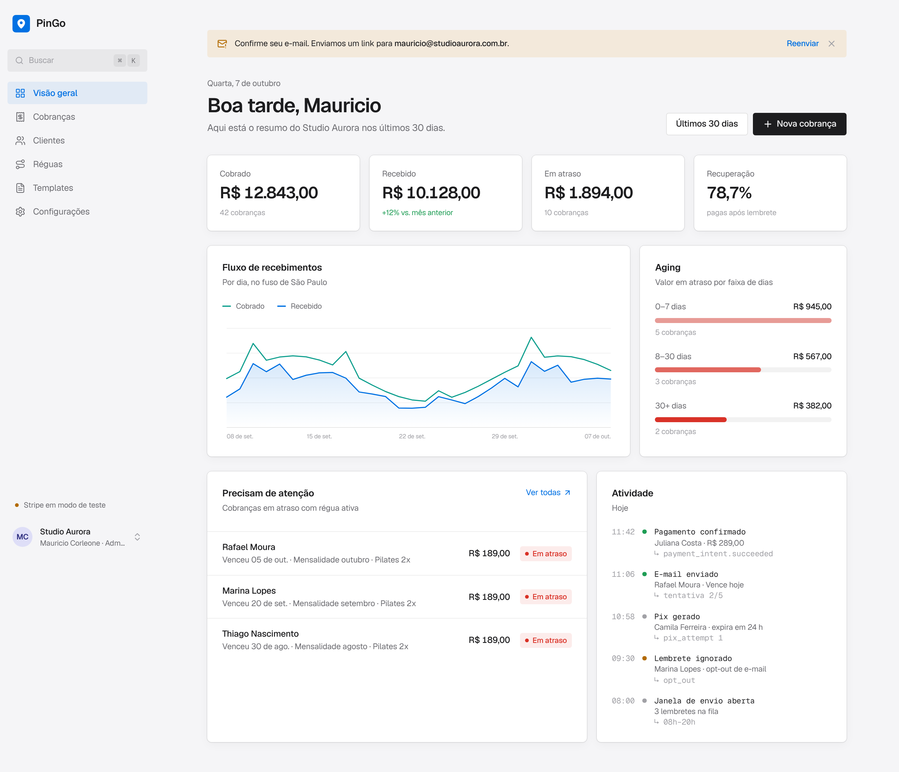
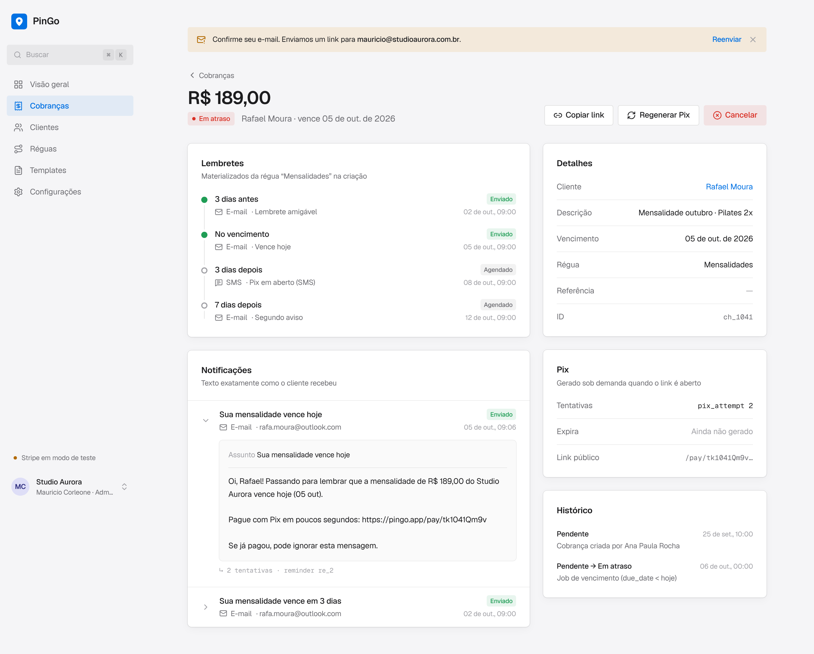
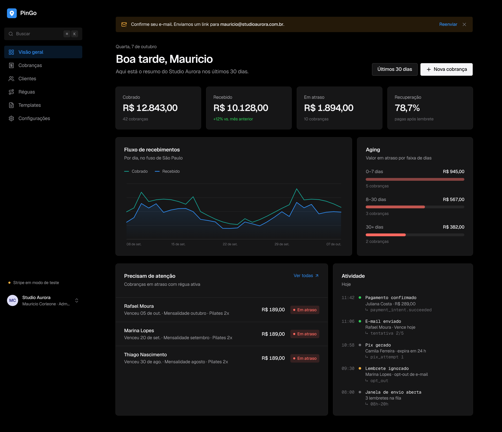
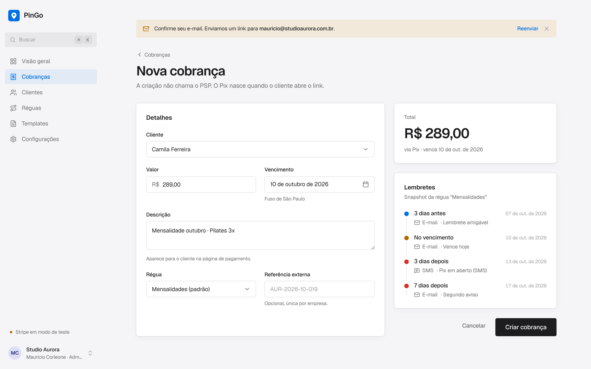
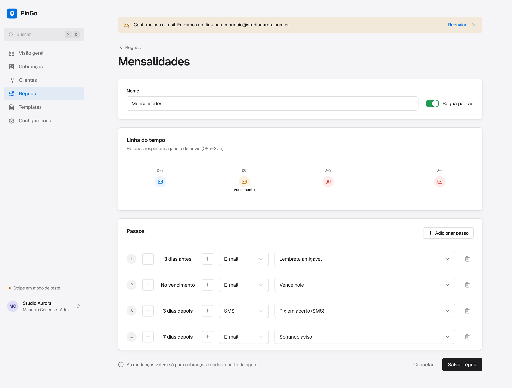
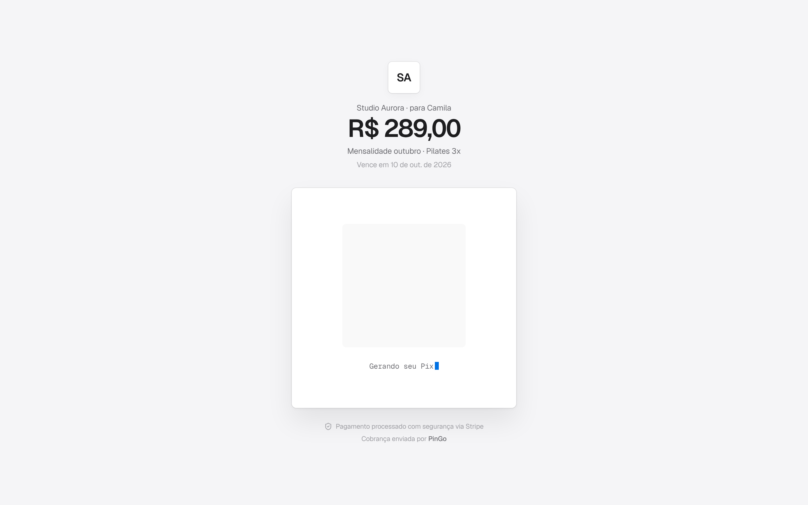
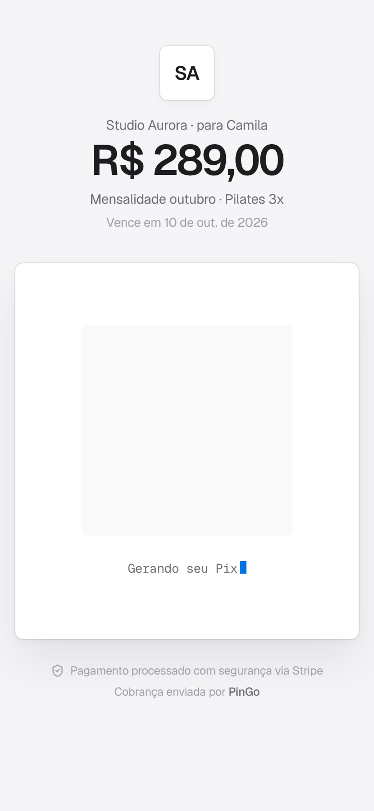

# PinGo · web

Front-end do **PinGo**, um SaaS multi-tenant de cobrança via Pix. A empresa cadastra clientes e cobranças, o devedor abre um link público e o Pix é gerado na hora, uma **régua de cobrança** manda lembretes por e-mail e SMS e o pagamento confirmado por webhook encerra os lembretes sozinho.

> **Status:** todas as telas da spec v0.4 estão prontas e rodando com dados mock.
> A integração com a API entra quando o [`pingo-api`](https://github.com/ggabmartins/pingo-api) tiver os primeiros endpoints.



## Stack

Next.js 15 (App Router) · React 19 · TypeScript · Tailwind CSS v4 · Radix UI · lucide-react · date-fns · fonte Geist

## Como rodar

Precisa de Node 20 ou mais novo.

```bash
npm install
npm run dev
```

Abra http://localhost:3000. A raiz redireciona para `/dashboard`.

| Script | O que faz |
|---|---|
| `npm run dev` | Servidor de desenvolvimento com hot reload |
| `npm run build` | Build de produção |
| `npm run start` | Sobe o build de produção |
| `npm run typecheck` | Checagem de tipos sem gerar arquivos |

## Telas

A coluna Spec aponta para os requisitos em [`docs/spec.md`](https://github.com/ggabmartins/pingo-api/blob/main/docs/spec.md) do pingo-api.

### Acesso

| Rota | Tela | Spec |
|---|---|---|
| `/login` | Entrar. Erro genérico e bloqueio progressivo após 5 tentativas | RF-01, RN-17 |
| `/signup` | Criar conta: cria a empresa (tenant) e o primeiro admin | RF-02 |
| `/forgot-password` | Pedir link de redefinição. A resposta é a mesma exista ou não a conta | RF-34 |
| `/reset-password/[token]` | Nova senha com no mínimo 12 caracteres. Encerra todas as sessões | RF-34 |
| `/verify-email/[token]` | Confirmação de e-mail | RF-35 |

### Painel

| Rota | Tela | Spec |
|---|---|---|
| `/dashboard` | Faturado x recebido, taxa de recuperação, aging dos atrasados, atividade recente | RF-28 |
| `/charges` | Lista de cobranças com filtro por status e busca | RF-10 |
| `/charges/new` | Nova cobrança com prévia dos lembretes que a régua vai gerar | RF-08, RF-16 |
| `/charges/[id]` | Detalhe: lembretes, notificações como o cliente recebeu, Pix, histórico, cancelar e regenerar Pix | RF-11, RF-12, RF-13, RF-22 |
| `/customers`, `/customers/new`, `/customers/[id]` | Clientes e opt-out por canal | RF-06, RF-07 |
| `/dunning`, `/dunning/[id]` | Réguas de cobrança com linha do tempo e editor de passos | RF-14 |
| `/templates`, `/templates/[id]` | Templates de e-mail e SMS com variáveis e pré-visualização | RF-15, RN-19 |
| `/profile` | Meu perfil: nome, tema, troca de senha por link e dados de acesso | RF-34 |

### Configurações

| Rota | Tela | Spec |
|---|---|---|
| `/settings` | Nome da empresa, fuso horário e janela de envio | RF-03 |
| `/settings/team` | Usuários e perfis (admin e operador) | RF-04 |
| `/settings/api-keys` | Criar e revogar API keys. A chave aparece uma vez só | RF-05 |
| `/settings/payments` | Conta Stripe, ambiente Sandbox ou Produção e rotação do segredo do webhook | RN-21 |
| `/settings/audit` | Log de auditoria das ações sensíveis | RF-36 |

### Páginas públicas

| Rota | Tela | Spec |
|---|---|---|
| `/pay/[token]` | Página do devedor. O Pix é gerado quando ele abre o link | RF-09, RF-27, RN-22 |
| `/unsubscribe/[token]` | Descadastro dos lembretes | RF-07 |

## Estados para testar

Como ainda não existe API, alguns estados são acessados pela URL.

| URL | Estado |
|---|---|
| `/login?erro=1` | E-mail ou senha incorretos |
| `/login?erro=bloqueado` | Conta bloqueada temporariamente |
| `/login?redefinida=1` | Aviso de senha redefinida |
| `/forgot-password?enviado=1` | Confirmação de envio do link |
| `/reset-password/expirado` | Link de redefinição vencido |
| `/verify-email/expirado` | Link de verificação inválido |
| `/pay/demo` | Cobrança pendente |
| `/pay/atraso` | Cobrança em atraso |
| `/pay/pago` | Cobrança paga (só o status aparece) |
| `/pay/cancelada` | Cobrança cancelada |
| `/pay/demo?erro=psp` | Falha ao gerar o Pix no provedor |

O usuário logado do mock está com o e-mail não verificado, então o aviso "Confirme seu e-mail" aparece no topo do painel.

## Estrutura

```
src/
├── app/
│   ├── (auth)/         login, cadastro, senha e verificação de e-mail
│   ├── (app)/          painel autenticado com sidebar
│   ├── pay/            página pública de pagamento
│   └── unsubscribe/    descadastro
├── components/
│   ├── ui.tsx          Button, Card, Field, Input, Table, StatusBadge e afins
│   ├── controls.tsx    Select, Switch, DatePicker e Dialog (Radix)
│   ├── sidebar.tsx
│   └── ...             gráfico de receita, timeline da régua, QR fake
├── lib/
│   ├── types.ts        tipos espelhando o contrato da API (seção 12 da spec)
│   ├── api.ts          camada de dados, uma função por endpoint
│   └── format.ts       moeda, datas e helpers de formatação
└── mocks/
    └── data.ts         dados de exemplo da empresa "Studio Aurora"
```

### Dados mock

Toda tela busca dados por `src/lib/api.ts`. Cada função ali corresponde a um endpoint da spec (`listCharges`, `getCharge`, `listAuditLog`...) e por enquanto lê de `src/mocks/data.ts`.

Quando a API existir, a troca acontece só nesse arquivo: as funções passam a chamar o cliente gerado a partir do OpenAPI e as telas continuam iguais. Os tipos em `src/lib/types.ts` seguem o mesmo contrato, então também podem ser substituídos pelos tipos gerados.

A data "de hoje" nos mocks é 7 de outubro de 2026, para os atrasos e vencimentos fazerem sentido.

### Autenticação

Ainda não há sessão real. O plano, seguindo a decisão D22 da spec:

- access token só em memória, nunca em `localStorage`
- refresh token em cookie `HttpOnly`, enviado pela própria API
- ao receber 401, tenta um refresh uma vez e, se falhar, volta para `/login`

## Design

- Visual minimalista, inspirado na Apple: fundo cinza claro, cards brancos e títulos grandes
- Cor de destaque azul `#0071e3` (`#2f8cf0` no modo escuro)
- Cantos quase retos, entre 3 e 8 px
- Sidebar sem bordas, com o item ativo em azul suave
- Detalhes técnicos (IDs, chaves, tentativas) em fonte mono
- Tema claro, escuro ou do sistema, escolhido no menu da conta (fica salvo no navegador)

Todas as cores ficam como variáveis em `src/app/globals.css`, então trocar a paleta é mexer em um lugar só. As cores do gráfico foram escolhidas para continuar distinguíveis por quem tem daltonismo, tanto no claro quanto no escuro.

| Claro | Escuro |
|---|---|
|  |  |

| Nova cobrança | Régua |
|---|---|
|  |  |

| Página de pagamento | Celular |
|---|---|
|  |  |

## Repositórios

- [`pingo-api`](https://github.com/ggabmartins/pingo-api): back-end, spec e infraestrutura
- `pingo-web` (este): front-end
